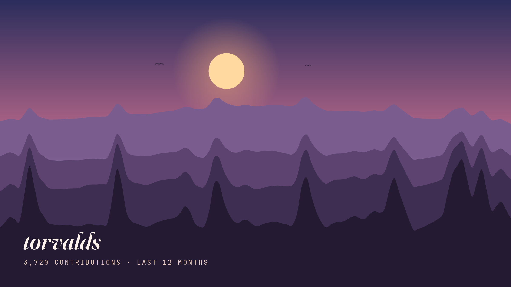

<div align="center">

# commit-scape - your commits as a landscape


**GitHub's green garden is a time series of intensity. commit-scape turns it into generative art: a procedural mountain range, a Truchet pattern, or a piece of music - downloadable as image or audio.**

</div>

<div align="center">



</div>

---

## Usage

1. Type a GitHub username and hit **Generate**. It works without a token; with one, the data is exact.
2. Pick a mode - **Landscape**, **Truchet** or **Sound** - and a palette.
3. Export: **PNG** at 2400×1350 for wallpapers, vector **SVG**, or **WAV** from Sound mode.

---

## Features

- **Three render modes** for the same contribution calendar:
  - **Procedural landscape** - each week of the year feeds the profile of a mountain range; four layers with atmospheric perspective, sun/moon, stars, mist and birds.
  - **Truchet** - every day is an arc tile whose rotation, weight and brightness follow the commit count.
  - **Sonification** - each week becomes a note on a minor pentatonic scale (it can't sound dissonant); pitch and volume track intensity.
- **Deterministic**: same username + same commits → the exact same piece on every load. The seed derives from the username.
- **Four palettes**: Dawn, Night, GitHub (classic green) and Monochrome.
- **Real exports**: PNG at 2400×1350 (wallpaper-grade), self-contained vector SVG, and WAV rendered offline (no real-time recording).
- **100% client-side**: no backend of its own. The (optional) token only travels from your tab to `api.github.com`; it is never stored.
- **IndexedDB cache** with a 6-hour TTL - contribution data changes daily.
- **Accessible and responsive**: semantic HTML, `prefers-reduced-motion`, visible focus.

---

## How it gets the data

GitHub exposes no public REST endpoint for the contribution calendar. Two paths:

1. **Official GraphQL (recommended)** - `contributionsCollection.contributionCalendar` with a Personal Access Token you paste into the app. A classic token **with no scopes** is enough for public data. Exact per-day counts.
2. **Token-less fallback** - several public sources are raced in parallel and the first good answer wins: a community mirror of the calendar (JSON with CORS enabled) plus three CORS proxies fronting the `github.com/users/{username}/contributions` fragment. It works the same with 12 commits as with 4,000, but it is still **less reliable** than a token: third-party services can rate-limit and GitHub can change its markup. The app clearly flags approximate data (levels 0–4 instead of exact counts).

```graphql
query($username: String!) {
  user(login: $username) {
    contributionsCollection {
      contributionCalendar {
        totalContributions
        weeks {
          contributionDays {
            date
            contributionCount
          }
        }
      }
    }
  }
}
```

---

## Project structure

```
commit-scape/
├── index.html              # Entry point (favicon inlined as data URI)
├── package.json            # Scripts and dependencies (+ lockfile)
├── tsconfig.json           # Strict TypeScript config
├── vite.config.ts          # Vite build (React plugin, relative base)
├── vitest.config.ts        # Unit test config
├── src/
│   ├── main.tsx            # React bootstrap, fonts and styles
│   ├── App.tsx             # Composition: hero / studio
│   ├── styles.css          # Design system (tokens + components)
│   ├── types.ts            # ContributionDay / ContributionYear / RenderMode
│   ├── vite-env.d.ts       # Vite client types
│   ├── lib/
│   │   ├── prng.ts         # hash + mulberry32 + value noise (deterministic)
│   │   ├── palettes.ts     # The four palettes
│   │   ├── landscape.ts    # Procedural curve (Catmull-Rom) and scene
│   │   ├── truchet.ts      # Tile layout
│   │   ├── github.ts       # GraphQL + token-less public sources
│   │   ├── cache.ts        # IndexedDB with TTL
│   │   ├── sonify.ts       # Intensity → note mapping (pure)
│   │   ├── player.ts       # Tone.js: playback and offline render
│   │   ├── wav.ts          # 16-bit PCM WAV encoder (pure)
│   │   └── export.ts       # SVG/PNG with embedded fonts
│   ├── hooks/
│   │   └── useContributions.ts
│   └── components/         # SearchBar, ModeTabs, PaletteSelector, Landscape,
│                           # Truchet, SoundPanel, ExportButtons
├── test/                   # Tests for every pure calculation
└── .github/                # demo.gif for this README
```

Every file has a single responsibility (SRP). All calculation logic (curves, noise, note mapping, WAV encoder) is pure and covered by tests.

---

## Technologies

| Tool | Purpose |
|------|---------|
| React 19 + TypeScript | UI |
| Vite | Build and dev server |
| Generative SVG | Artwork rendering (exportable by design) |
| Tone.js | Sonification and offline WAV render |
| IndexedDB | Calendar cache (6 h) |
| Vitest | Unit tests |
| Vercel | Web version hosting |
| Fraunces / Space Grotesk / JetBrains Mono | Typography (via Fontsource) |

---

<div align="center">

*Your graph, hanging on a wall.*

</div>
