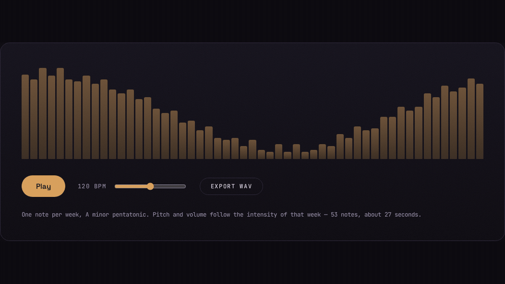

<div align="center">

# commit-scape — tus commits como un paisaje


**El jardín verde de GitHub es una serie temporal de intensidad. commit-scape lo convierte en arte generativo: una cordillera procedural, un patrón Truchet o una pieza musical — descargable como imagen o audio.**

[English version ↓](#english)

</div>



---

## Características

- **Tres modos de render** para el mismo calendario de contribuciones:
  - **Paisaje procedural** — cada semana del año alimenta el perfil de una cordillera; cuatro capas con perspectiva atmosférica, sol/luna, estrellas, niebla y pájaros.
  - **Truchet** — cada día es una baldosa de arcos cuya rotación, grosor y brillo dependen del commit count.
  - **Sonificación** — cada semana es una nota de una pentatónica menor (nunca suena disonante); tono y volumen siguen la intensidad.
- **Determinista**: mismo usuario + mismos commits → exactamente la misma pieza en cada carga. La semilla deriva del username.
- **Cuatro paletas**: Amanecer, Noche, GitHub (verde clásico) y Monocromo.
- **Exportación real**: PNG a 2400×1350 (wallpaper), SVG vectorial autocontenido y WAV renderizado offline (no grabación en tiempo real).
- **100% client-side**: sin backend propio. El token (opcional) solo viaja de tu pestaña a `api.github.com`; nunca se guarda.
- **Caché en IndexedDB** con TTL de 6 horas — los datos cambian a diario.
- **Accesible y responsive**: HTML semántico, `prefers-reduced-motion`, foco visible.

---

## Cómo obtiene los datos

GitHub no expone un endpoint REST público para el calendario de contribuciones. Hay dos caminos:

1. **GraphQL oficial (recomendado)** — `contributionsCollection.contributionCalendar` con un Personal Access Token que pegas en la app. Un token clásico **sin scopes** basta para datos públicos. Datos exactos por día.
2. **Fallback sin token** — varias fuentes públicas se consultan en paralelo y gana la primera que responda: un espejo comunitario del calendario (JSON con CORS habilitado) y tres proxies CORS al fragmento `github.com/users/{usuario}/contributions`. Funciona igual con 12 commits que con 4.000, pero sigue siendo **menos confiable** que el token: servicios de terceros pueden tener rate-limit y GitHub puede cambiar su HTML. La app indica claramente cuando los datos son aproximados (niveles 0–4 en vez de counts exactos).

```graphql
query($username: String!) {
  user(login: $username) {
    contributionsCollection {
      contributionCalendar {
        totalContributions
        weeks {
          contributionDays {
            date
            contributionCount
          }
        }
      }
    }
  }
}
```

---

## Estructura del proyecto

```
commit-scape/
├── index.html
├── public/
│   └── favicon.svg
├── src/
│   ├── main.tsx            # Entrada, fuentes y estilos
│   ├── App.tsx             # Composición: hero / estudio
│   ├── styles.css          # Sistema de diseño (tokens + componentes)
│   ├── types.ts            # ContributionDay / ContributionYear / RenderMode
│   ├── lib/
│   │   ├── prng.ts         # hash + mulberry32 + value noise (determinista)
│   │   ├── palettes.ts     # Las cuatro paletas
│   │   ├── landscape.ts    # Curva procedural (Catmull-Rom) y escena
│   │   ├── truchet.ts      # Layout de baldosas
│   │   ├── github.ts       # GraphQL + fallback de scraping
│   │   ├── cache.ts        # IndexedDB con TTL
│   │   ├── sonify.ts       # Mapeo intensidad → nota (puro)
│   │   ├── player.ts       # Tone.js: reproducción y render offline
│   │   ├── wav.ts          # Encoder WAV PCM 16-bit (puro)
│   │   └── export.ts       # SVG/PNG con fuentes incrustadas
│   ├── hooks/
│   │   └── useContributions.ts
│   └── components/         # SearchBar, ModeTabs, PaletteSelector,
│                           # Landscape, Truchet, SoundPanel, ExportButtons
├── test/                   # Tests de toda función pura de cálculo
└── .github/workflows/      # Deploy automático a GitHub Pages
```

Cada archivo tiene una responsabilidad única (SRP). Toda la lógica de cálculo (curvas, ruido, mapeo de notas, encoder WAV) es pura y está cubierta por tests.

---

## Tecnologías

| Herramienta | Uso |
|-------------|-----|
| React 19 + TypeScript | UI |
| Vite | Build y dev server |
| SVG generativo | Render del arte (exportable por diseño) |
| Tone.js | Sonificación y render offline a WAV |
| IndexedDB | Caché del calendario (6 h) |
| Vitest | Tests unitarios |
| Fraunces / Space Grotesk / JetBrains Mono | Tipografía (vía Fontsource) |

---

## Desarrollo

```bash
npm install
npm run dev      # dev server
npm test         # tests unitarios
npm run build    # typecheck + build de producción
```

## Despliegue

Cada push a `main` construye y publica en GitHub Pages (`.github/workflows/deploy.yml`). Activa **Settings → Pages → Source: GitHub Actions** en el repo.

---

<a name="english"></a>

<div align="center">

# commit-scape — your commits as a landscape


**GitHub's green garden is a time series of intensity. commit-scape turns it into generative art: a procedural mountain range, a Truchet pattern, or a piece of music — downloadable as image or audio.**

</div>

---

## Features

- **Three render modes** for the same contribution calendar:
  - **Procedural landscape** — each week of the year feeds the profile of a mountain range; four layers with atmospheric perspective, sun/moon, stars, mist and birds.
  - **Truchet** — every day is an arc tile whose rotation, weight and brightness follow the commit count.
  - **Sonification** — each week becomes a note on a minor pentatonic scale (it can't sound dissonant); pitch and volume track intensity.
- **Deterministic**: same username + same commits → the exact same piece on every load. The seed derives from the username.
- **Four palettes**: Dawn, Night, GitHub (classic green) and Monochrome.
- **Real exports**: PNG at 2400×1350 (wallpaper-grade), self-contained vector SVG, and WAV rendered offline (no real-time recording).
- **100% client-side**: no backend of its own. The (optional) token only travels from your tab to `api.github.com`; it is never stored.
- **IndexedDB cache** with a 6-hour TTL — contribution data changes daily.
- **Accessible and responsive**: semantic HTML, `prefers-reduced-motion`, visible focus.

---

## How it gets the data

GitHub exposes no public REST endpoint for the contribution calendar. Two paths:

1. **Official GraphQL (recommended)** — `contributionsCollection.contributionCalendar` with a Personal Access Token you paste into the app. A classic token **with no scopes** is enough for public data. Exact per-day counts.
2. **Token-less fallback** — several public sources are raced in parallel and the first good answer wins: a community mirror of the calendar (JSON with CORS enabled) plus three CORS proxies fronting the `github.com/users/{username}/contributions` fragment. It works the same with 12 commits as with 4,000, but it is still **less reliable** than a token: third-party services can rate-limit and GitHub can change its markup. The app clearly flags approximate data (levels 0–4 instead of exact counts).

---

## Development

```bash
npm install
npm run dev      # dev server
npm test         # unit tests
npm run build    # typecheck + production build
```

## Deploy

Every push to `main` builds and publishes to GitHub Pages (`.github/workflows/deploy.yml`). Enable **Settings → Pages → Source: GitHub Actions** on the repo.

---

<div align="center">

*Your graph, hanging on a wall.*

</div>
